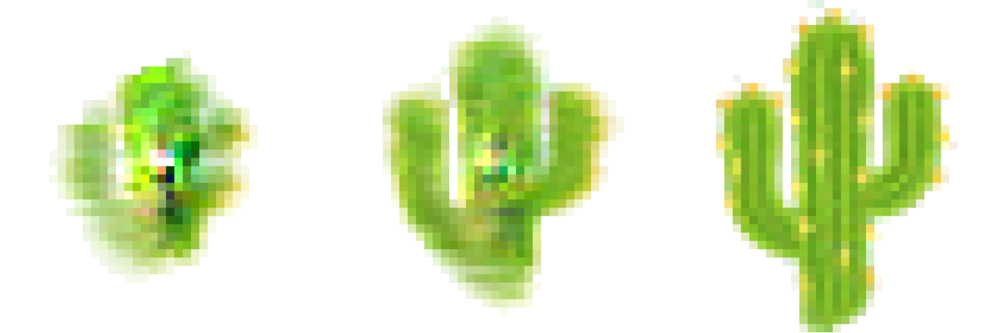

# Neural Cellular Automata with WebGPU

**[Demo](https://ivanludvig.dev/neural-ca-webgpu)**

A WebGPU demo of [Growing Neural Cellular Automata](https://doi.org/10.23915/distill.00023) (Mordvintsev et al., 2020).

Each cell in the 40×40 grid is a compute shader thread, running inference through a shared pretrained NN to compute its next state.

